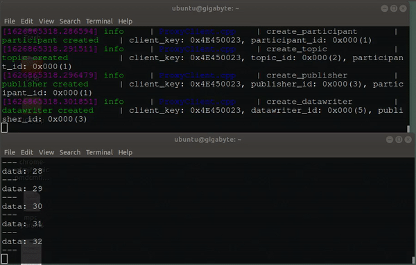

# micro_ros_platformio

This is an experimental [micro-ROS](https://github.com/micro-ROS) app to use [PlatformIO](https://platformio.org/) as an alternative to Arduino IDE in developing [micro_ros_arduino](https://github.com/micro-ROS/micro_ros_arduino) based firmware on Teensy series boards. Here are a few motivations why:

- Allow headless development since you don't need the Arduino IDE to program your firmware with PlatformIO.

- Less setup required. PlatformIO automatically downloads [micro_ros_arduino](https://github.com/micro-ROS/micro_ros_arduino) as a dependency, the first time you compile your code.

- Provide a development template for PlatformIO users.

# Installation

## 1. Installing ROS2 and micro-ROS in the host computer

Follow these [instructions](https://micro.ros.org/docs/tutorials/core/teensy_with_arduino/) on micro-ROS' wiki on how to use Teensy with Arduino - *Installing ROS 2 and micro-ROS in the host compute* .

## 2. Install PlatformIO

You can check out the installation guide how to Install PlatformIO [here](https://docs.platformio.org/en/latest//core/installation.html).

## 3. UDEV Rule
Download the udev rules from Teensy's website:

    wget https://www.pjrc.com/teensy/00-teensy.rules

and copy the file to /etc/udev/rules.d :

    sudo cp 00-teensy.rules /etc/udev/rules.d/


## 4. Configure your Teensy Board
The default board used in this demo is Teensy 3.6 but you can uncomment the Teensy board you're using

    [env:teensy36]
    board = teensy36

    ; [env:teensy35]
    ; board = teensy35

    ; [env:teensy36]
    ; board = teensy36


## 5. Upload the firmware

Upload the firmware by running:

    cd micro_ros_platformio
    pio run --target upload

# Hardware: Dual LS7366R Quadrature Encoder Buffer

The robot reads its wheel encoders through a **dual LS7366R** quadrature encoder
buffer board (e.g. SuperDroid Robots' dual-channel LS7366R board). The LS7366R is
a 32-bit quadrature counter with an SPI interface: it counts the encoder A/B
transitions in hardware and holds the running total, so the Teensy never misses
ticks no matter how fast the motors spin or how busy the firmware is. The "dual"
board carries **two LS7366R chips — one per drive wheel** — sharing a single SPI
bus with independent chip-select (CS) lines.

## Wiring (Teensy 4.0)

```text
  TEENSY 4.0                       DUAL LS7366R BOARD                  ENCODERS
  ──────────                       ──────────────────                  ────────

  pin 13  SCK  ─────────────►  SCK  ┐
  pin 11  MOSI ─────────────►  MOSI ├── one SPI bus, shared by both chips
  pin 12  MISO ◄─────────────  MISO ┘
  3V3          ─────────────►  VCC      power both chips at 3.3 V
  GND          ─────────────►  GND

  pin 6   CS   ─────────────►  SS1 ──► LS7366R #1 (LEFT)  ──► A B (I) ──► LEFT  encoder
  pin 5   CS   ─────────────►  SS2 ──► LS7366R #2 (RIGHT) ──► A B (I) ──► RIGHT encoder

  Arrows show signal direction.  A/B = quadrature channels, I = index (optional).
  SCK/MOSI/MISO/VCC/GND are common to both chips; only the CS lines differ.
  Each encoder's V+/GND are supplied by the board.
```

| Signal       | Teensy 4.0 pin | Notes |
|--------------|----------------|-------|
| SCK          | 13             | hardware SPI clock, shared by both chips |
| MOSI         | 11             | shared |
| MISO         | 12             | shared |
| CS — left    | 6              | `EncoderCSLeft` in [`src/main.cpp`](src/main.cpp) |
| CS — right   | 5              | `EncoderCSRight` in [`src/main.cpp`](src/main.cpp) |
| GND          | GND            | common ground with the Teensy and the encoders |

Each wheel's quadrature encoder (channels A/B, plus index if present) wires into
its own LS7366R channel on the board.

> ⚠️ **3.3 V logic.** The Teensy 4.0's pins are **not 5 V tolerant**. Run the
> board's logic at 3.3 V to match the Teensy, or put a level shifter on the SPI
> lines — driving SCK/MOSI/CS at 5 V can damage the Teensy.

## Firmware

- Driver: [`lib/encoder/Encoder.cpp`](lib/encoder/Encoder.cpp), which wraps the
  SuperDroid **[Encoder-Buffer-Library](https://github.com/SuperDroidRobots/Encoder-Buffer-Library)**
  (declared under `lib_deps` in [`platformio.ini`](platformio.ini)). One
  `Encoder_Buffer(csPin)` instance drives each chip; `SPI.begin()` is called once
  in the `Encoder` constructor before initialising either chip.
- The counters run in **x4 quadrature mode** (4 counts per encoder line cycle) as
  free-running 32-bit signed counters; `readEncoder()` returns the current count.
- The **left** count is negated (`-encoderLeft->readEncoder()`) because that wheel
  is mounted mirrored — flip the sign here (or swap the encoder A/B leads) if a
  wheel counts the wrong direction.
- Counts are converted to wheel RPM (from count deltas over time) and published as
  `/vel` (a `geometry_msgs/Twist`). The conversion uses `TICKS_PER_REVOLUTION` and
  `WHEEL_DIAMETER` in [`src/main.cpp`](src/main.cpp). **`TICKS_PER_REVOLUTION` must
  match your encoder counts-per-rev × gearing, in x4** (this robot uses `130000`);
  set it for your drivetrain — the file keeps commented presets for other robots.

## Notes / troubleshooting

- Both chips share SCK/MOSI/MISO and differ only in CS. If **one** wheel reads a
  flat 0, suspect that chip's CS wiring/jumper, not the SPI bus.
- The counter is 32-bit and free-running; odometry uses count **deltas**, so a
  counter wrap between reads doesn't corrupt the velocity estimate.
- A wheel counting backwards usually means swapped A/B leads or a sign flip needed
  in `Encoder.cpp`.

# Running the demo

## 1. Publisher
Run the micro-ROS agent to relay the data streaming from your microcontroller to your host computer through the Serial port:

    ros2 run micro_ros_agent micro_ros_agent serial --dev /dev/ttyACM0

## 2. Subscriber
Now you can use ros2 topic tool to display the messages being published by the agent:

    ros2 topic echo /micro_ros_arduino_node_publisher

## Expected results



## Troubleshooting Guide

1. Nothing's displayed on ros2 topic echo.
- Try unplugging your microcontroller after uploading the firmware and run the agent again.